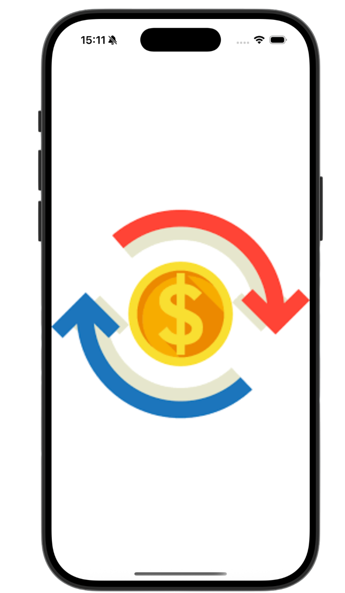
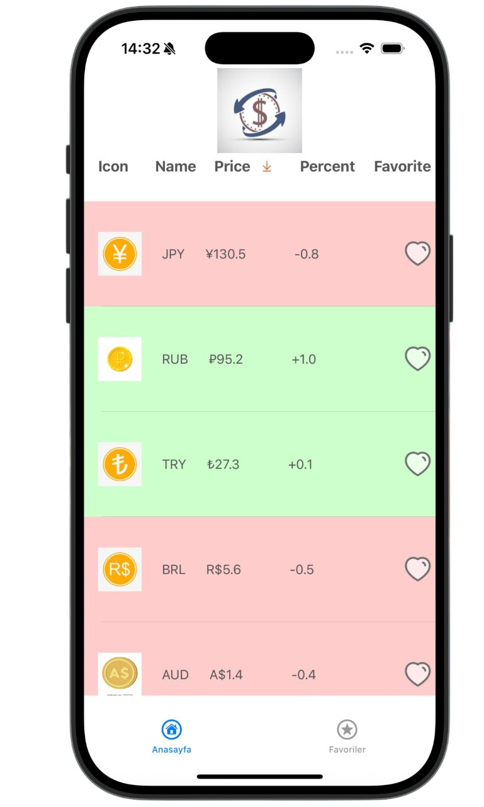
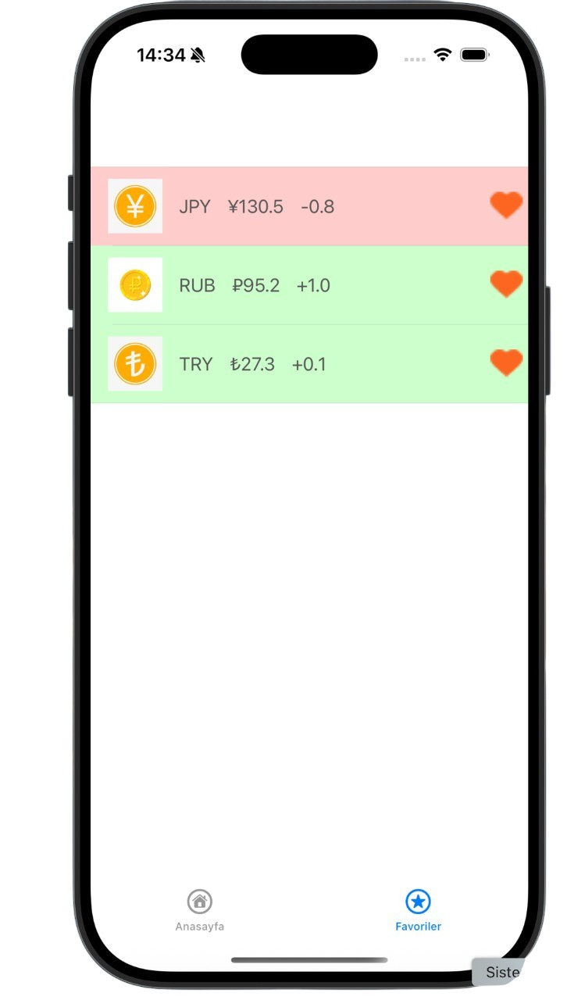
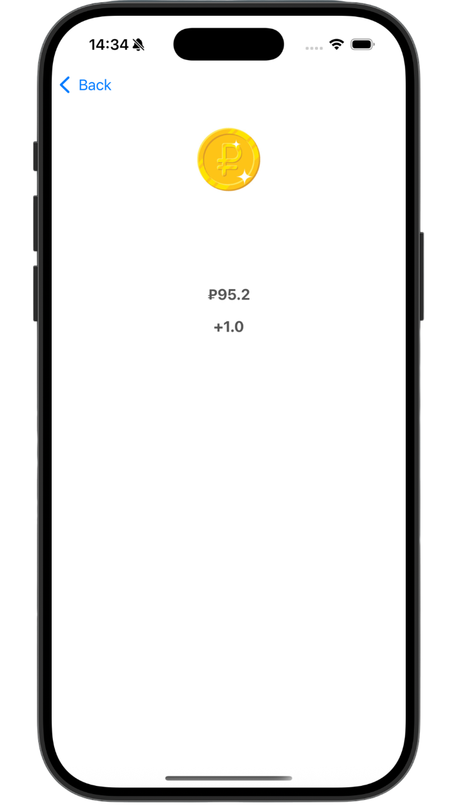
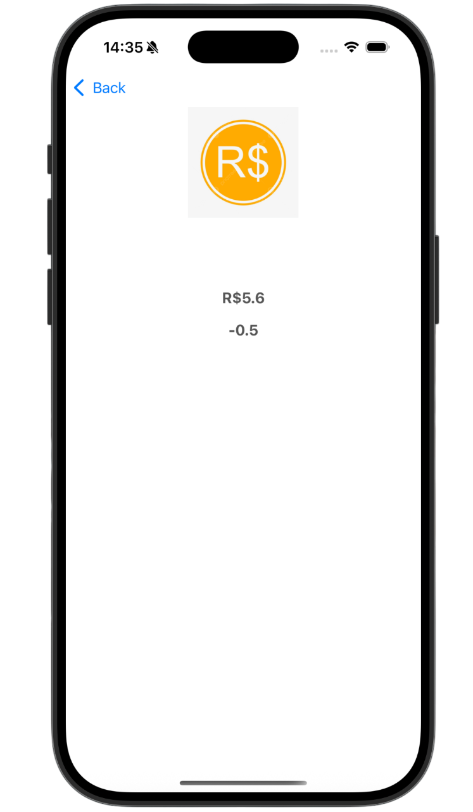

# DövizListesiApp
iOS platformu için Swift ile geliştirilen döviz uygulamasıdır. Kullanıcılar döviz kurlarını listeleyebilir, filtreleyebilir, sıralayabilir ve favorilerine ekleyebilir. Her döviz birimi için detay sayfası bulunmaktadır. Bu proje, Flo Teknoloji'de iOS App Developer olarak gerçekleştirdiğim staj sürecinde geliştirilmiştir.

---

## 🔑 Özellikler

- 📈 Günlük artış/azalışa göre filtreleme
- ⭐ Para birimlerini favorilere ekleyip çıkarma
- 📊 Dövizlerin adı, logosu ve değişim yüzdesi gösterimi
- 🧾 Detay sayfasında para birimi hakkında geniş bilgi
- 📁 JSON dosyasından gelen statik veri
- 🔄 Basit ve sade kullanıcı arayüzü
- 🔽 Tab Bar ile Anasayfa ve Favoriler arası geçiş

---

## 🖼 Ekran Görüntüleri

### Launch Ekranı


### Ana Sayfa
  

### Favoriler
 

### Detay Sayfası
<table>
  <tr>
    <td></td>
    <td></td>
  </tr>
</table>

---

## 🛠️ Kullanılan Teknolojiler

- **Swift**
- **UIKit**
- **Xcode**
- **JSON (Statik veri kaynağı)**

---

## 📂 JSON Yapısı

Veriler `currencies.json` dosyasından yüklenmektedir. Örnek yapı:

```json
[
  {
    "name": "Dolar",
    "code": "USD",
    "logo": "usd.png",
    "change": 0.85,
    "isFavorite": false
  }
]
```

## 🛠 Kurulum

Projeyi çalıştırmak için aşağıdaki adımları izleyebilirsiniz:

### 🔽 Reponun klonlanması

git clone https://github.com/busratosunn/DovizListesiApp.git
cd DovizListesiApp
open "Döviz Listesi.xcodeproj"

---

## 📁 Proje Yapısı

```
DovizListesiApp/
├── Döviz Listesi.xcodeproj         # Xcode proje dosyası
├── Assets/                         # Uygulama görselleri ve varlıkları
├── Models/                         # Veri modelleri (CurrencyModel.swift vb.)
├── Views/                          # Arayüz bileşenleri (anasayfa, detay, favoriler)
├── Controllers/                    # Görünümleri yöneten view controller dosyaları
├── ScreenShots/                    # Uygulama ekran görüntüleri (README için)
└── README.md                       # Proje açıklaması ve belgeleri
```
